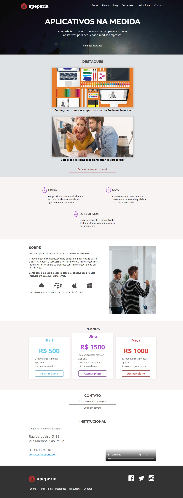

<h1 align="center" style="text-transform: uppercase">Apeperia</h1>

<h3 align="center">Projeto desenvolvido no curso de Layouts Responsivos da Alura.</h3>

 

  

## Tópicos

- [Tópico 1 - Imagem](#tópico-1)
- [Tópico 2 - Descrição](#tópico-2)
- [Tópico 3 - Status](#tópico-3)
- [Tópico 4 - Acesso](#tópico-4)
- [Tópico 5 - Tecnologias](#tópico-5)
- [Tópico 6 - Licença](#tópico-6)

 

## Tópico 1
## 📷 Imagem do projeto

    

 

## Tópico 2
## 📖 O que é a Apeperia?

A Apeperia é uma empresa focada na criação e desenvolvimento de aplicativos personalizados para todas as plataformas.

A partir de seus planos de assinatura (Start, Mega e Ultra), a Apeperia também realiza manutenções de aplicativos dos clientes.

A empresa oferece serviços de qualidade feitos por especialistas nos assuntos propostos, oferece foco nos empreendimentos, oferece preços acessíveis de acordo com a qualidade dos serviços e propostas, e atende rigorosamente aos prazos determinados.

 

## Tópico 3
## ⌛ Status do projeto

<h4 style="text-transform: uppercase; color: #0F0">✔️ Projeto finalizado</h4>

 

## Tópico 4
## 🔗 Acesso ao projeto

Clique [aqui](https://fel1324.github.io/Apeperia/) para acessar o projeto.

 

## Tópico 5
## 🔭 Tecnologias utilizadas

* HTML e CSS
* Git e Github

 

## Tópico 6
## 📝 Licença

Esse projeto está sob a licença MIT.
